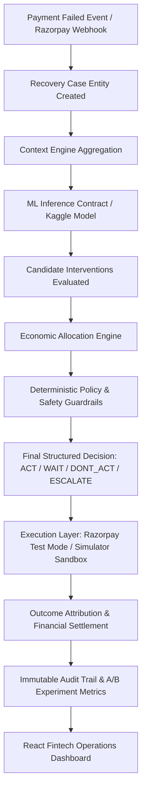

# Razorpay Recovery Intelligence & Allocation Engine
> **Razorpay AI Buildathon 2026**

[](file:///d:/Projects/Desktop/agy2-projects/Razorpay/backend/tests)
[](https://fastapi.tiangolo.com)
[](https://react.dev)
[](#core-thesis)

---

## Core Thesis

> **"Recovery rate is the wrong optimization target. Incremental contribution is."**

Traditional payment recovery systems blindly blast SMS reminders, payment links, and aggressive retries on every failed payment. This strategy is economically suboptimal:
1. **Wasted Costs on Natural Recoveries**: Many failures (e.g. transient gateway downtime, temporary UPI timeouts) naturally recover on their own (80%+ natural baseline). Intervening produces zero incremental revenue while incurring gateway fees, messaging costs, and customer fatigue.
2. **Negative Contribution Interventions**: For low-ticket payments, intervention and friction costs often exceed the expected incremental recovery value.
3. **Customer Goodwill & Brand Erosion**: Blasting users who are already on DND or who attempted payment minutes ago causes unsubscriptions and disputes.

The **Recovery Intelligence & Allocation Engine** formulates payment recovery as an **Incremental Uplift & Economic Allocation problem**, governed by **deterministic policy safety guardrails**.

---

## Architectural Highlights



### 1. Replaceable ML Inference Contract
The ML layer is treated as an abstract dependency (`MLModelService`). The application comes with a high-fidelity `MockMLModelService` out-of-the-box and can easily be replaced with any Kaggle-trained XGBoost/PyTorch model without changing business logic or APIs. See [`docs/ml_contract.md`](file:///d:/Projects/Desktop/agy2-projects/Razorpay/docs/ml_contract.md).

### 2. Economic Optimization Objective Function
$$\text{Incremental Lift} = P(\text{recovery} \mid \text{action}) - P(\text{recovery} \mid \text{no action})$$
$$\text{Expected Incremental Revenue} = \text{Incremental Lift} \times \text{Payment Amount}$$
$$\text{Incremental Contribution} = \text{Expected Incremental Revenue} - \text{Action Cost} - \text{Incentive Cost} - \text{Friction Cost}$$

### 3. Deterministic Safety Guardrails (Zero Direct AI Execution Authority)
- **Bounded Retries**: Caps automated retries to prevent bank penalties.
- **Customer DND / Opt-Out**: Strict suppression of outbound communications for opted-out users.
- **Contact Cooldown**: Enforces a minimum 24-hour spacing between customer touchpoints.
- **Quiet Hours Compliance**: Automatically delays nighttime outreach (9 PM – 9 AM) to the morning window (`WAIT`).
- **High-Value Transaction Escalation**: Automatically routes transactions $\ge$ ₹50,000 to white-glove human support.
- **Positive Contribution Floor**: Vetoes actions with negative net ROI.

---

## 5-Step Buildathon Judge Demo Experience

The application includes 5 seeded demo scenarios that prove the core thesis in under 5 minutes:

| Step | Scenario | Characteristics | Engine Decision | Why It Proves the Thesis |
|---|---|---|---|---|
| **1** | **High Natural Recovery** | 82% natural vs 87% with link (only 5% lift) | `DONT_ACT` | Proves the engine suppresses wasteful interventions when natural recovery is high. |
| **2** | **Low Natural + High Uplift** | 12% natural vs 71% with link (+59% lift) | `ACT` (`PAYMENT_LINK`) | Proves the engine deploys links when incremental contribution is strongly positive (₹2,946+ net). |
| **3** | **Multi-Action Economics** | Link 76% vs Retry 32% vs Reminder 52% | `ACT` (`PAYMENT_LINK`) | Ranks all 6 candidate actions and selects highest net contribution rather than highest raw probability. |
| **4** | **Deterministic Safety Veto** | ML recommends link (+45% lift), customer contacted 3h ago | `DONT_ACT` (`VETOED`) | Demonstrates that deterministic policy overrides AI to prevent customer spam. |
| **5** | **High-Value Escalation** | Enterprise ₹75,000 transaction failure | `ESCALATE` | Mandates white-glove manual assistance for high-ticket payments. |

---

## 5-Policy Monte Carlo Benchmark

The simulator enables side-by-side benchmarking of 5 policies over 100–1,000 synthetic payments:
1. **Policy A: No Action (Natural Baseline)**: Baseline natural recovery without costs.
2. **Policy B: Fixed Retry (Blind Retries)**: Triggers retries on all failures regardless of reason.
3. **Policy C: Rule-Based (Heuristics)**: Static error-code mapping.
4. **Policy D: ML Propensity**: Acts when $P(\text{recovery}) > 0.50$, ignoring natural baseline and costs.
5. **Policy E: Uplift + Economic Allocation Engine (Our Thesis)**: **Outperforms all policies by maximizing net contribution and eliminating unnecessary contacts.**

---

## Project Structure

```
Razorpay/
├── backend/
│   ├── app/
│   │   ├── api/                   # REST API routes (Cases, Decisions, Simulator, Webhooks, etc.)
│   │   ├── core/                  # Database, Config, Security, Structured Logging
│   │   ├── models/                # SQLAlchemy ORM models
│   │   ├── schemas/               # Pydantic input/output contracts
│   │   ├── services/
│   │   │   ├── context/           # Context Aggregation
│   │   │   ├── ml/                # MLModelService contract & MockMLModelService
│   │   │   ├── economics/         # Economic Allocation Engine
│   │   │   ├── policy/            # Deterministic Safety & Policy Engine
│   │   │   ├── decision/          # Decision Engine
│   │   │   ├── execution/         # Dual Gateway (Razorpay Test Mode + Simulator)
│   │   │   ├── attribution/       # Outcome Attribution & Financial Settlement
│   │   │   ├── experiments/       # A/B Experimentation Engine
│   │   │   ├── simulator/         # Monte Carlo Simulator & Scenarios
│   │   │   └── audit/             # Immutable Audit Logger
│   │   ├── integrations/razorpay/ # Webhook verification & test mode client
│   │   └── main.py                # FastAPI app initialization
│   ├── tests/                     # 16 Pytest test suites (100% pass)
│   └── requirements.txt
├── frontend/
│   ├── src/
│   │   ├── components/            # Navigation, Layout, Metric Cards, Badges
│   │   ├── pages/                 # 7 Core Pages + 1 Demo Showcase
│   │   │   ├── CommandCenter.tsx  # Executive KPIs & Financial ROI
│   │   │   ├── RecoveryQueue.tsx  # Filterable cases pipeline
│   │   │   ├── CaseDetail.tsx     # 8-step visual audit trail timeline
│   │   │   ├── DecisionExplorer.tsx # Interactive Sandbox matrix
│   │   │   ├── Experiments.tsx    # 5-Policy benchmark comparison
│   │   │   ├── SimulatorPage.tsx  # Monte Carlo sandbox & domain randomization
│   │   │   ├── GovernanceSafety.tsx # Guardrail rules & safety veto logs
│   │   │   └── DemoShowcase.tsx   # 5-step guided buildathon walkthrough
│   │   ├── services/api.ts        # Typed REST client
│   │   └── App.tsx
│   └── package.json
├── docs/                          # System Architecture, Economic Model, ML Contract
├── scripts/run_dev.py             # Single-command launcher
├── docker-compose.yml             # Containerized deployment
└── README.md
```

---

## Quickstart & Running Locally

### 1. Prerequisites
- Python 3.10+
- Node.js 18+

### 2. Backend Setup & Tests
```bash
# Activate existing myvenv virtual environment
# Windows (PowerShell):
.\myvenv\Scripts\Activate.ps1
# Windows (CMD):
.\myvenv\Scripts\activate.bat
# Linux/macOS:
source myvenv/bin/activate

# Install Python dependencies (already installed in myvenv)
pip install -r backend/requirements.txt

# Run full test suite (16 tests)
python -m pytest -v
```

### 3. Frontend Setup
```bash
cd frontend
npm install
npm run build
```

### 4. Launch Application (Dev Mode)
Run both backend (`http://localhost:8000`) and frontend (`http://localhost:5173`) with:
```bash
python scripts/run_dev.py
```
- **Frontend Dashboard**: [http://localhost:5173](http://localhost:5173)
- **FastAPI Interactive Docs**: [http://localhost:8000/docs](http://localhost:8000/docs)

---

## Docker Deployment

```bash
docker-compose up --build
```
- Frontend: [http://localhost:3000](http://localhost:3000)
- Backend: [http://localhost:8000/docs](http://localhost:8000/docs)
