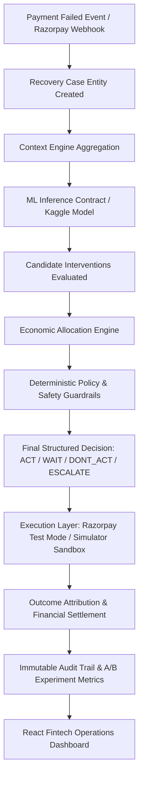

# System Architecture: Recovery Intelligence & Allocation Engine

## Core Thesis
> **"Recovery rate is the wrong optimization target. Incremental contribution is."**

A blind optimization for recovery rate wastes money intervening on customers who would have recovered naturally (e.g. transient bank glitches) and spams loyal customers. Our engine separates natural baseline recovery from intervention-driven uplift, balancing expected recovery values against intervention costs, incentive costs, and customer friction costs under deterministic policy guardrails.

---

## Architectural Data Flow

---

## Key Trust Boundaries

1. **AI / ML Model Service**:
   - Strictly advisory. Outputs probabilistic natural recovery $P(\text{recovery} \mid \text{no action})$, action probabilities $P(\text{recovery} \mid \text{action})$, and confidence scores.
   - **Never has direct execution authority or access to payment credentials.**

2. **Economic Allocation Engine**:
   - Calculates exact net incremental contribution:
     $$\text{Incremental Lift} = P(\text{recovery} \mid \text{action}) - P(\text{recovery} \mid \text{no action})$$
     $$\text{Expected Incremental Revenue} = \text{Lift} \times \text{Payment Amount}$$
     $$\text{Incremental Contribution} = \text{Expected Incremental Revenue} - \text{Action Cost} - \text{Incentive Cost} - \text{Friction Cost}$$
   - Deterministically ranks actions.

3. **Deterministic Safety Engine**:
   - Absolute authority over action dispatch.
   - Hard policy rules:
     - **Bounded Retry Limits**: Caps automated retries.
     - **Customer DND / Opt-Out**: Suppresses messaging.
     - **Contact Cooldown**: Enforces 24-hour spacing.
     - **Quiet Hours Compliance**: Holds nighttime outreach until 9:00 AM.
     - **High-Value Transaction Escalation**: Routes payments $\ge$ ₹50,000 to VIP human support.
     - **Positive Contribution Floor**: Vetoes actions with negative net ROI.

4. **Execution Layer**:
   - Dual-gateway abstraction (`RazorpayTestGateway` and `SimulatorGateway`).
   - Constant-time HMAC-SHA256 signature verification over raw request bytes.
